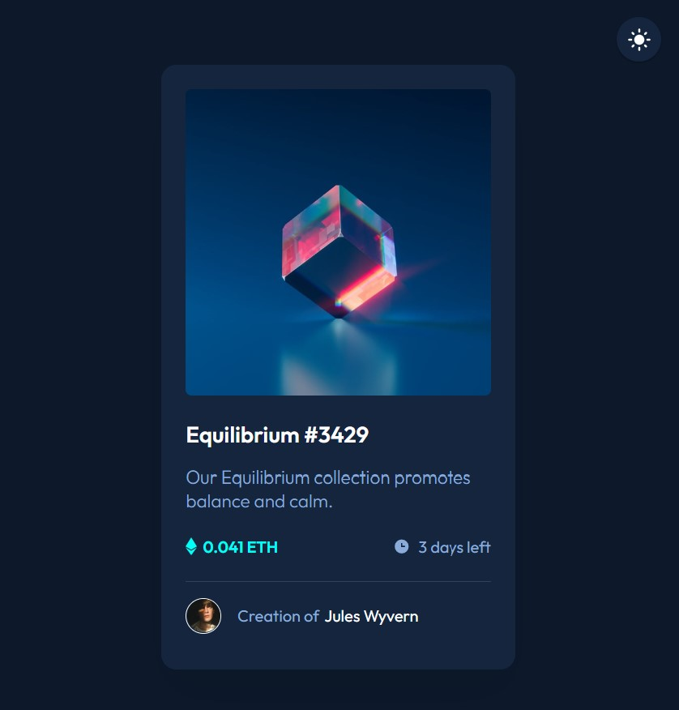

# Frontend Mentor - NFT preview card component solution

This is a solution to the [NFT preview card component challenge on Frontend Mentor](https://www.frontendmentor.io/challenges/nft-preview-card-component-SbdUL_w0U). Frontend Mentor challenges help you improve your coding skills by building realistic projects. 

## Table of contents

- [Overview](#overview)
  - [The challenge](#the-challenge)
  - [Screenshot](#screenshot)
  - [Links](#links)
- [My process](#my-process)
  - [Built with](#built-with)
  - [Useful resources](#useful-resources)

**Note: Delete this note and update the table of contents based on what sections you keep.**

## Overview

### The challenge

Users should be able to:

- View the optimal layout depending on their device's screen size
- See hover states for interactive elements

As an additional challenge, I added a light mode design with a toggle to switch between dark and light mode themes. 

### Screenshots

**Dark Mode:**

**Light Mode:**

### Links

- Solution URL: https://github.com/aaronrubinstein/NFT-preview-card-component
- Live Site URL: https://aaronrubinstein.github.io/NFT-preview-card-component

## My process

### Built with

- HTML
- CSS
- A few lines of Javascript for the light/dark mode toggle

### Useful resources

- [Dark Mode in CSS by Treehouse](https://www.youtube.com/watch?v=xPC8DhxItTU) - This was a helpful guide for how to implement a dark/light mode toggle using CSS and a small amount of Javascript.
